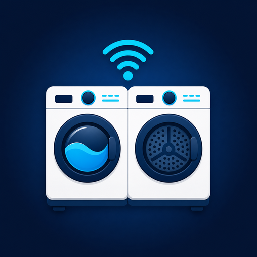

# Maytag Appliance for Home Assistant

  

This custom integration provides status sensors for Maytag washers and dryers
using the Whirlpool cloud API. It supports Home Assistant GUI setup and does
not require YAML configuration.

## Features

- GUI setup through **Settings > Devices & services**.
- Washer and dryer appliance IDs.
- Editable password and appliance IDs through **Reconfigure**.
- Existing Maytag entity IDs and state attributes retained for compatibility.
- Dedicated entities for appliance status, connectivity, doors, cycles, and
  remaining time.
- Two-minute cloud polling.
- HACS custom repository support.

## Entities

### Washer

- Washer Alert
- Washer Online
- Washer Remote Enabled
- Washer Status
- Washer Door
- Washer Door Locked
- Washer Cycle ID
- Washer Cycle Name
- Washer Need Clean
- Washer Time Remaining
- Washer End Time

### Dryer

- Dryer Online
- Dryer Remote Enabled
- Dryer Status
- Dryer Door
- Dryer Cycle ID
- Dryer Cycle Name
- Dryer Temperature
- Dryer Time Remaining
- Dryer End Time

Online, remote-enabled, door, door-locked, need-clean, and alert values are
binary sensors. Status, cycle, temperature, and time values are sensors.

## Installation

### HACS

1. Open HACS and select **Integrations**.
2. Open the menu and choose **Custom repositories**.
3. Add `https://github.com/bditter/maytag-appliance-homeassistant` as an
   **Integration** repository.
4. Install **Maytag Appliance** and restart Home Assistant.

### Manual

1. Copy `custom_components/maytag_appliance` into the Home Assistant
   `custom_components` directory.
2. Restart Home Assistant.

## Configuration

1. Remove the old `maytag_dryer` sensor platform block from
   `configuration.yaml` if upgrading from the YAML integration.
2. Open **Settings > Devices & services > Add integration**.
3. Search for **Maytag Appliance** and enter the Maytag app account and
   washer/dryer appliance IDs.

To update a password or appliance ID later, open the integration and choose
**Configure**, then **Reconfigure**.

## Attribution

This project is based on
[jdeath/maytag_dryer_homeassistant](https://github.com/jdeath/maytag_dryer_homeassistant).
It retains the original washer/dryer behavior and compatibility attributes
while adding GUI configuration and config-entry lifecycle support.

## License

Licensed under the [MIT License](LICENSE.txt). The original copyright and
license notice from `jdeath/maytag_dryer_homeassistant` are retained.
